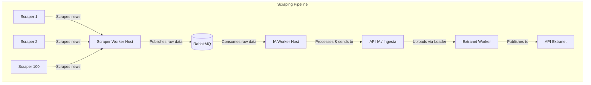

# Implementation Plan: Bolivian Daily Scraper Worker (DDD + Clean Architecture)

This document describes the plan for creating the Scraper Worker using **Clean Architecture** and **Domain-Driven Design (DDD)** in .NET 10. The scraping worker is the first part of a larger pipeline that extracts, processes, and publishes content.

## System Pipeline Overview



---

## Architecture Design

To support scaling up to **100+ different scrapers** without creating spaghetti code, we will implement a hybrid strategy:
1. **Generic Config-Driven Scraper (HTML Selectors)**: A single implementation class that reads CSS selectors or XPaths from a configuration (JSON, DB, etc.) to extract fields (Title, Body, Image, Date). This covers 80-90% of standard, static news sites.
2. **Custom Scrapers (Code-Based)**: For sites with complex requirements (dynamic JavaScript loading, multi-step authentication, API payloads), we can write custom scrapers implementing a common `IScraper` interface.

### Layer Structure

To accommodate the full system pipeline and keep the codebase clean and modular, we structure the workspace using **Option A (Separation by Bounded Contexts)**. Físicamente, el código fuente reside en carpetas dentro de `/src/` en el disco duro, pero en Visual Studio se expone mediante carpetas lógicas individuales (`Shared`, `ScraperWorker`, `old-deprecated`), eliminando la carpeta contenedora virtual `/src/` del Explorador de Soluciones.

```text
bolivian-daily-worker/                      # Raíz física del Repositorio
├── BolivianDaily.slnx                      # Solución (.slnx) con carpetas lógicas
├── docker-compose.yml                      # Configuración de RabbitMQ / Postgres
├── src/                                    # Carpeta física en disco
│   ├── Shared/                             # Shared Kernel (Modelos compartidos)
│   │   └── BolivianDaily.Shared/
│   │
│   └── ScraperWorker/                      # Bounded Context del Scraper
│       ├── Domain/                         # BolivianDaily.ScraperWorker.Domain (Librería)
│       ├── Application/                    # BolivianDaily.ScraperWorker.Application (Librería)
│       ├── Infrastructure/                 # BolivianDaily.ScraperWorker.Infrastructure (Librería)
│       └── Host/                           # BolivianDaily.ScraperWorker.Host (Servicio Worker)
│
└── tests/                                  # Pruebas automatizadas
    └── ScraperWorker/
        └── BolivianDaily.ScraperWorker.UnitTests/
```

*(Nota: En el futuro, a medida que el pipeline crezca, se agregarán carpetas físicas e independientes en la raíz de Visual Studio como `/IAWorker/` para el IAWorker y `/ApiIA/` para la API).*

Nos enfocamos en la implementación del `ScraperWorker` y `Shared` primero:
- **`BolivianDaily.Shared` (Shared Kernel)**:
  - Contains cross-cutting contracts, base classes, and DTOs that are shared between different microservices (e.g. RabbitMQ message contracts like `ScrapedItemMessage`).
- **`BolivianDaily.ScraperWorker.Domain` (Core)**: 
  - Represents the core business rules and types.
  - No dependencies on database libraries, scraping packages, or message brokers.
  - Contains entities (`ScraperConfig`, `ScrapingJob`), value objects (`Url`, `ScrapedContent`), domain events (`ContentScrapedEvent`), and repository interfaces.
- **`BolivianDaily.ScraperWorker.Application` (Use Cases)**:
  - Contains orchestrator logic (handling commands/queries, e.g. `ExecuteScrapingJobCommand`).
  - Defines ports/interfaces: `IScraper`, `IScraperRegistry`, `IMessageBus` (RabbitMQ publisher contract).
  - Handles the flow: read scraper configuration -> execute scraper -> emit event -> publish to RabbitMQ.
- **`BolivianDaily.ScraperWorker.Infrastructure` (Adapters)**:
  - Implements the contracts defined in Application/Domain.
  - Scraping implementations using `HttpClient` & `HtmlAgilityPack` (or Playwright if dynamic scraping is required later).
  - RabbitMQ publishing implementation using `RabbitMQ.Client`.
  - Config/DB implementations (reading configs from JSON or database).
- **`BolivianDaily.ScraperWorker.Host` (Host)**:
  - The .NET Generic Host / `BackgroundService`.
  - Configures dependency injection, logging (`Serilog` or `Spectre.Console` for rich logs), and runs the execution loop/scheduler.

---

## Proposed Changes

We will create a brand new set of clean projects under `src/` and reference them in a clean solution.

### [Component: Shared]
#### [NEW] [BolivianDaily.Shared.csproj](file:///d:/maestria/taller-arquitectura/bolivian-daily-worker/src/Shared/BolivianDaily.Shared/BolivianDaily.Shared.csproj)
- Class library containing common models and messaging contracts.
#### [NEW] [ScrapedNewsMessage.cs](file:///d:/maestria/taller-arquitectura/bolivian-daily-worker/src/Shared/BolivianDaily.Shared/Messages/ScrapedNewsMessage.cs)
- The concrete contract class representing the RabbitMQ integration message published by the scraper.

### [Component: Domain Layer]
#### [NEW] [ScraperConfig.cs](file:///d:/maestria/taller-arquitectura/bolivian-daily-worker/src/ScraperWorker/Domain/Entities/ScraperConfig.cs)
- Holds the source name, base URL, target URL, and parsing selectors (TitleSelector, ContentSelector, DateSelector, etc.).
#### [NEW] [ScrapedContent.cs](file:///d:/maestria/taller-arquitectura/bolivian-daily-worker/src/ScraperWorker/Domain/ValueObjects/ScrapedContent.cs)
- A immutable value object representing the scraped news item before processing.

### [Component: Application Layer]
#### [NEW] [IScraper.cs](file:///d:/maestria/taller-arquitectura/bolivian-daily-worker/src/ScraperWorker/Application/Interfaces/IScraper.cs)
- `Task<ScrapedContent> ScrapeAsync(ScraperConfig config, CancellationToken cancellationToken)`
#### [NEW] [IMessageBus.cs](file:///d:/maestria/taller-arquitectura/bolivian-daily-worker/src/ScraperWorker/Application/Interfaces/IMessageBus.cs)
- `Task PublishScrapedContentAsync(ScrapedContent content, CancellationToken cancellationToken)`
#### [NEW] [ExecuteScrapingJobCommand.cs](file:///d:/maestria/taller-arquitectura/bolivian-daily-worker/src/ScraperWorker/Application/UseCases/ExecuteScrapingJobCommand.cs)
- The main use case handler that runs the scraper and publishes the message.

### [Component: Infrastructure Layer]
#### [NEW] [HtmlAgilityPackScraper.cs](file:///d:/maestria/taller-arquitectura/bolivian-daily-worker/src/ScraperWorker/Infrastructure/Scrapers/HtmlAgilityPackScraper.cs)
- Extends `IScraper` using `HttpClient` and `HtmlAgilityPack` to parse the HTML document based on the `ScraperConfig` selectors.
#### [NEW] [RabbitMQMessageBus.cs](file:///d:/maestria/taller-arquitectura/bolivian-daily-worker/src/ScraperWorker/Infrastructure/Messaging/RabbitMQMessageBus.cs)
- Implements `IMessageBus` utilizing the `RabbitMQ.Client` library to publish scraped news to a RabbitMQ exchange.

### [Component: Host Layer]
#### [NEW] [ScraperBackgroundService.cs](file:///d:/maestria/taller-arquitectura/bolivian-daily-worker/src/ScraperWorker/Host/ScraperBackgroundService.cs)
- A .NET `BackgroundService` that reads the configs and loops through the scraping jobs periodically.
#### [NEW] [Program.cs](file:///d:/maestria/taller-arquitectura/bolivian-daily-worker/src/ScraperWorker/Host/Program.cs)
- Setting up DI container, configuration mapping, and host builder.

---

## Verification Plan

### Automated Tests
- We will configure unit tests in a test project `tests/ScraperWorker/BolivianDaily.ScraperWorker.UnitTests` to verify:
  - HTML parsing logic with sample HTML strings.
  - Use case orchestration (mocking scrapers and message bus).

### Manual Verification
1. **Mock Scraper Test**: Run a scraping run against a test or public news URL and verify that the HTML is parsed correctly.
2. **RabbitMQ Publish Test**: Connect to a RabbitMQ instance, run the worker, and inspect the RabbitMQ Management Console to verify that a JSON payload was published to the queue/exchange with correct formatting.
